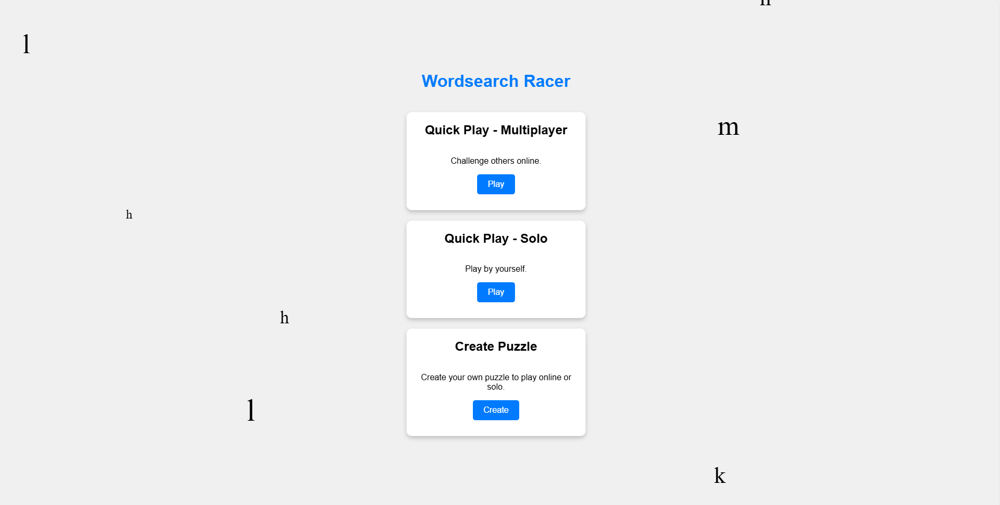

# Wordsearch Racer
This is a real-time multiplayer word search webapp built with Flask and socketio. Find the demo [here](http://wordsearch-racer.replit.app)

I built this to get more practice with javascript, as well as an introduction to flask and websockets. After reading "A Common Sense Guide to Data Structures and Algorithms" a word search generator seemed 
like an interesting challenge to tackle.

## Issues
- The game does not work properly on mobile devices. Getting mobile input to work was simple, but the way we're marking found words is an svg overlay and getting that to properly align with the game on a mobile layout has been tricky.
- The "game over" screen does not look great. I'm not much of a designer so i'll leave this for now.
- On play testing, I encounted an issue where sometimes when sending an invite link to someone else they would get the "game not found. Check your link" screen. My first thought was maybe the deployment servers (this is hosted on replit) aren't in sync "or something", so I lowered the deployment to 1 machine since we're realistically never going to hit many users on this. This did fix the issue - so i'll need to research how to avoid that in the future when i have an app that *does* need to scale.
